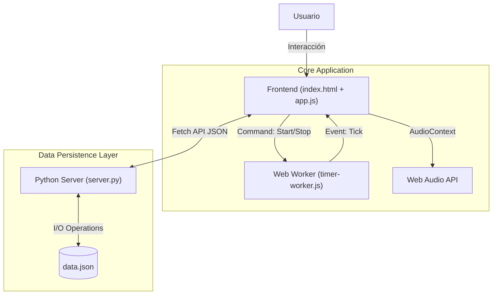

# ChronoMaster Studio ⏱️

**ChronoMaster Studio** es una plataforma web progresiva (PWA-ready) diseñada para la gestión avanzada del tiempo. Combina una interfaz de usuario reactiva construida con Vanilla JS y Tailwind CSS, respaldada por un backend ligero en Python para persistencia de datos y sincronización de estado.


## 🏗️ Arquitectura del Sistema

La aplicación utiliza un patrón de arquitectura híbrida donde el estado crítico del tiempo se maneja en un **Web Worker** dedicado para garantizar precisión independientemente del hilo principal de la UI, mientras que la persistencia se gestiona a través de una API REST local.



## 🚀 Instalación y Ejecución

### Opción 1: Usuarios de Windows (Automático)
Hemos incluido un script de automatización para facilitar el despliegue.

1.  Ubica el archivo `start.bat` en la raíz del proyecto.
2.  Haz **doble clic** sobre él.
3.  El script verificará tu instalación de Python, levantará el servidor local y abrirá la aplicación en tu navegador automáticamente.

### Opción 2: Manual (Desarrolladores / Mac / Linux)

1.  **Clonar el repositorio:**
    ```bash
    git clone https://github.com/alfonso-lopez-dev/chronoMaster-studio.git
    cd chronoMaster-studio
    ```

2.  **Iniciar el Servidor Backend:**
    La aplicación requiere el servidor Python para guardar tus configuraciones y timers.
    ```bash
    # Asegúrate de tener Python 3.x instalado
    python server.py
    ```
    *El servidor iniciará en `http://localhost:8000`*

3.  **Acceder a la App:**
    Abre tu navegador y visita `http://localhost:8000`.

## 💻 Detalles Técnicos

### 1. Precisión Temporal (Web Worker)
Para evitar el "drift" de tiempo causado por la throttling del navegador cuando la pestaña está inactiva, delegamos el conteo de tiempo a un `Worker`.

*   **Archivo:** `js/timer-worker.js`
*   **Mecanismo:** `setInterval` ejecutado en un hilo separado.
*   **Comunicación:** Mensajería asíncrona (`postMessage`) hacia el hilo principal para renderizado UI.

### 2. Sistema de Audio (Web Audio API)
No utilizamos archivos MP3/WAV estáticos. Todos los sonidos se sintetizan en tiempo real utilizando la **Web Audio API**. Esto permite:
*   Carga instantánea (sin latencia de red).
*   Personalización infinita de frecuencias y ondas.
*   Menor peso del proyecto.

**Ejemplo de oscilador 'Digital':**
```javascript
const osc = ctx.createOscillator();
osc.type = 'square';
osc.frequency.setValueAtTime(600, ctx.currentTime);
osc.frequency.linearRampToValueAtTime(800, ctx.currentTime + 0.1);
// ... gain control & connections
```

### 3. Persistencia de Datos
El estado de la aplicación se guarda automáticamente en `data.json`.

**Estructura del Schema:**
```json
{
  "theme": "fire", // Tema visual seleccionado
  "timers": [
    {
      "id": 1715629384,
      "label": "Sprint Code",
      "mode": "timer", // 'timer' | 'stopwatch'
      "duration": 1500000, // ms
      "currentTime": 1200000,
      "isRunning": false,
      "sound": "digital"
    }
  ]
}
```

### 4. API Endpoints
El backend (`server.py`) expone los siguientes endpoints:

| Método | Endpoint | Descripción | Payload |
| :--- | :--- | :--- | :--- |
| `GET` | `/api/data` | Recupera el estado completo | N/A |
| `POST` | `/api/data` | Guarda el estado actual | JSON object completo |

## 📂 Estructura del Proyecto

```
chronoMaster-studio/
├── assets/             # Recursos estáticos (imágenes)
├── css/
│   └── style.css       # Estilos personalizados adicionales a Tailwind
├── js/
│   ├── app.js          # Lógica principal, UI, Drag&Drop, Audio
│   └── timer-worker.js # Hilo de fondo para el reloj
├── data.json           # Base de datos local (creada automáticamente)
├── index.html          # Punto de entrada de la aplicación
├── server.py           # Servidor ligero Python (HTTP + JSON I/O)
├── start.bat           # Launcher automático para Windows
└── README.md           # Documentación
```

## 🎨 Temas Disponibles
El sistema de temas utiliza variables CSS y clases de Tailwind inyectadas dinámicamente para cambiar la paleta de colores completa:
*   **Default:** Indigo / Cyan
*   **Fuego:** Orange / Red
*   **Bosque:** Emerald / Green
*   **Océano:** Cyan / Blue

---
Desarrollado con ❤️ por [Alfonso Lopez](https://github.com/alfonso-lopez-dev)
